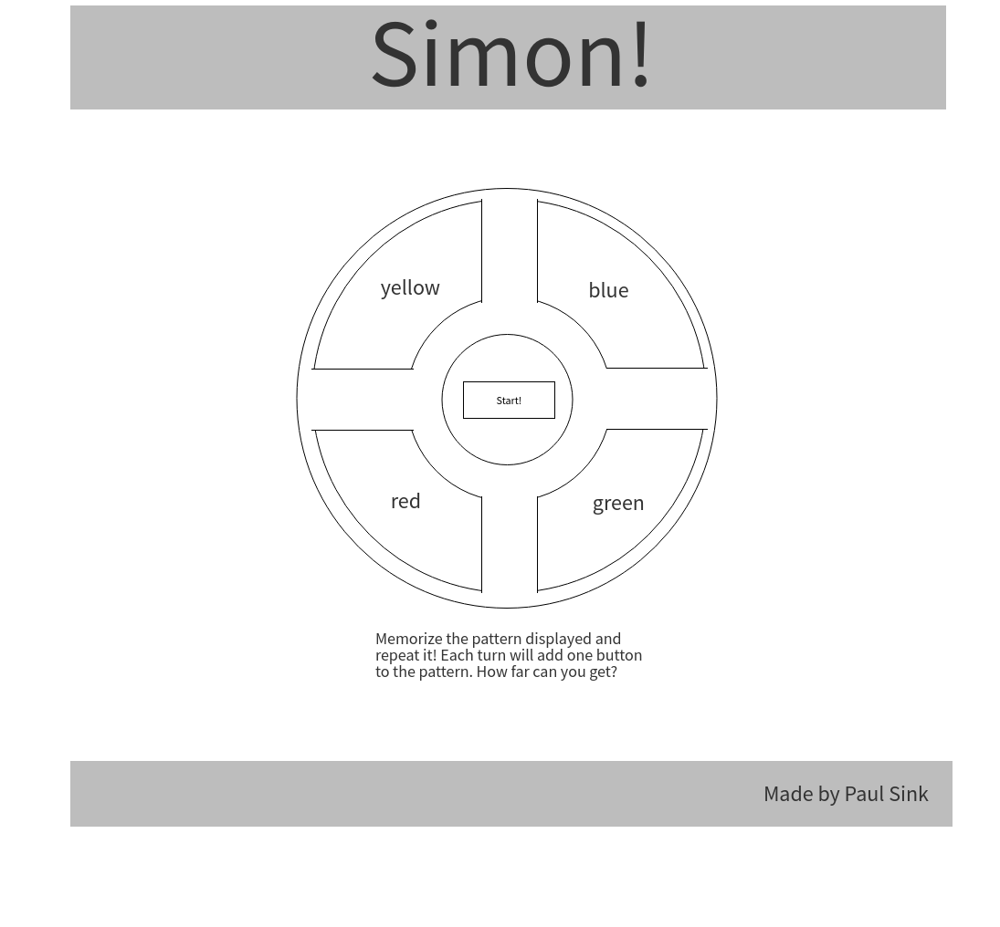

# Simon_Project1

## Description
For this project, I will be creating an interactive game of Simon where the user will be given a random sequence of buttons displayed to them and will need to memorize and press those buttons in the correct order. Each turn, the game will add another random button to the sequence.

## Approach

My initial approach began with breaking down my deliverables into three outcomes. The three outcomes, bronze, silver, and gold, are my checkpoints in my porject building process. My first objective would be to get to my bronze outcome. Then, I can move into focusing on my silver outcome. Lastly, I can move onto my final outcome, gold. This keeps me focused on highest priorities and helps with time management.

### Bronze

My first outcome, bronze, would be focused on meeting my deliverables for the project. The goal is to create a functioning Simon game that the player can play without any major bugs or issues. I will focus on creating a very simple gameboard in HTML, adding only necessary styling (button color, etc.) in CSS, and creating the interactive mechanics in JavaScript. This will also inclue the time for deployment of my Simon game so that it can be accessed by users. I estimate this portion of the project to take approximately 18 hours to complete.

### Silver

My second outome, silver, will be focused on improving the styling of the project. This will be important so that it feels like a real Simon game. I will focus on giving the game a more realistic look using "illuminating" buttons, sounds effects, click animation, and more! Because I am only editing what is already in place, this will take much less time. I estimate this portion to take 7-8 hours to complete.

### Gold

Lastly, my gold outcome will be focused on perfecting the game. I will focus on additional interactivity such as an all time highscore tracker that keeps track even when the page is reloaded and potentially additional game modes. This portion would be an additional 10 hours to complete.

### Wireframe

## Example

### Gameplay

### Player Loss

## Features

## Installation

## Contribution Guidelines